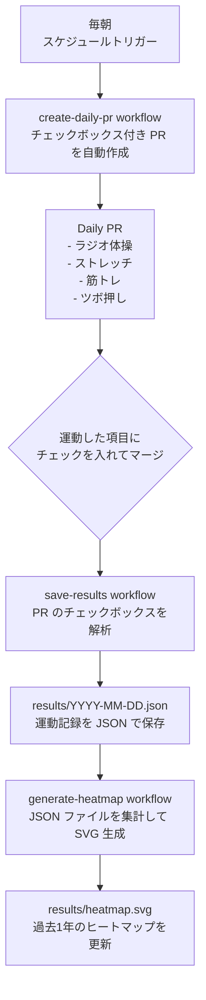

# FitnessStreak

毎日のフィットネス記録を自動的に GitHub で管理し、ストリークを継続するためのリポジトリです。

GitHub Actions が毎朝 PR を自動作成し、チェックボックスにチェックを入れてマージするだけで運動履歴が蓄積されます。過去1年分の活動が GitHub スタイルのヒートマップで可視化されます。

## 概念図



## ワークフロー

| ワークフロー | トリガー | 処理内容 |
| --- | --- | --- |
| `create-daily-pr` | 毎朝 6:15 JST (スケジュール) | 当日付きのチェックボックス入り PR を自動作成 |
| `save-results` | `fitness/*` ブランチの PR マージ時 | PR 本文のチェックボックスを解析し JSON に保存 |
| `generate-heatmap` | `results/*.json` の push / 毎日 3:00 JST | 全 JSON を集計してヒートマップ SVG を生成・コミット |

## データ構造

各日の記録は `results/YYYY-MM-DD.json` に以下の形式で保存されます。

```json
{
  "date": "2026-01-01",
  "exercises": {
    "ラジオ体操": true,
    "ストレッチ": true,
    "筋トレ": false,
    "ツボ押し": true
  }
}
```

## Heatmap


[results](./results/)

## Manual heatmap generation

```bash
python .github/scripts/generate_heatmap.py
```

The script reads JSON files from `results/` and writes the SVG to `results/heatmap.svg`.
Requires Python 3.9+. No third-party packages needed.
