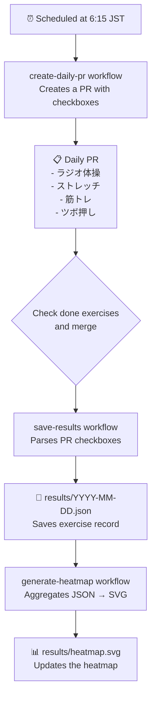

# FitnessStreak

Track and archive my daily fitness history to keep the streak alive.

## Concept



## Workflows

| Workflow | Trigger | Description |
| --- | --- | --- |
| `create-daily-pr` | Daily schedule at 6:15 JST | Creates a PR with exercise checkboxes for the day |
| `save-results` | PR merged on `fitness/*` branch | Parses PR body checkboxes and saves results to JSON |
| `generate-heatmap` | Push to `results/*.json` / daily at 3:00 JST | Aggregates all JSON files and commits an updated SVG heatmap |

## Data structure

Each day's record is saved as `results/YYYY-MM-DD.json`:

```json
{
  "date": "2026-01-01",
  "exercises": {
    "ラジオ体操": true,
    "ストレッチ": true,
    "筋トレ": false,
    "ツボ押し": true
  }
}
```

## Heatmap


[results](./results/)

## Manual heatmap generation

```bash
python .github/scripts/generate_heatmap.py
```

The script reads JSON files from `results/` and writes the SVG to `results/heatmap.svg`.
Requires Python 3.9+. No third-party packages needed.
