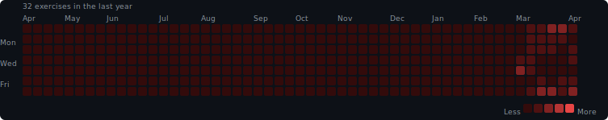

# FitnessStreak

Track and archive my daily fitness history to keep the streak alive.

## Heatmap



[results](./results/)

## Manual heatmap generation

```bash
python .github/scripts/generate_heatmap.py
```

The script reads JSON files from `results/` and writes the SVG to `results/heatmap.svg`.
Requires Python 3.9+. No third-party packages needed.
